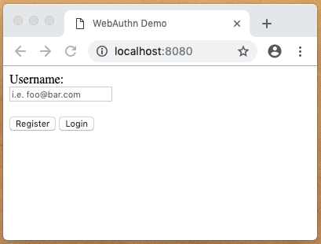
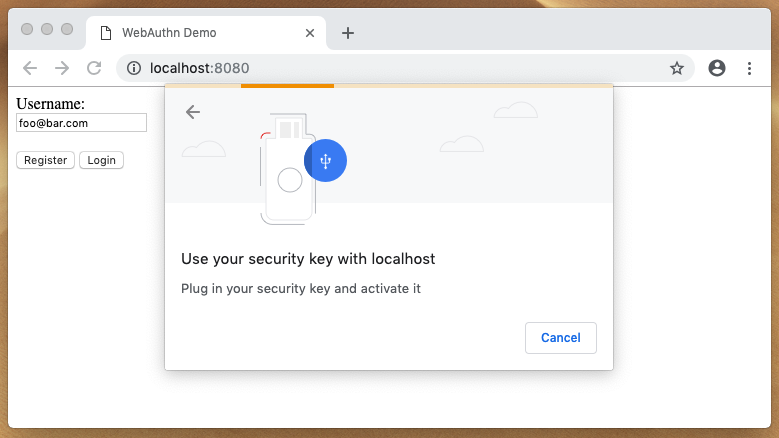
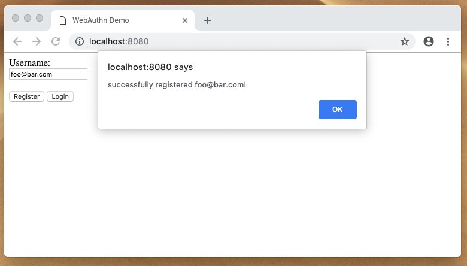
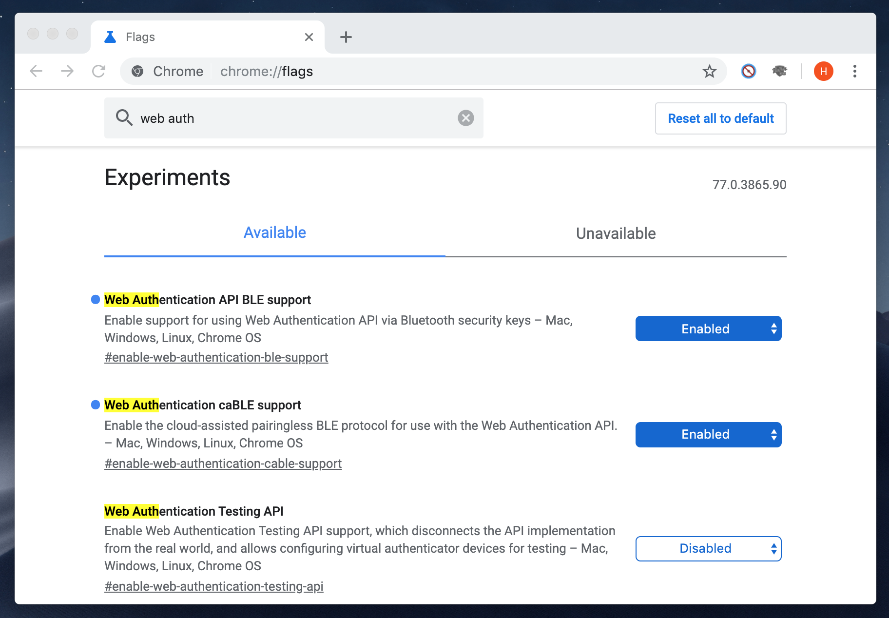

# Setting Up
In VMWare, go to VM->Settings->Options->Shared Folders. Disable, OK, Enable, OK. Link doesn't persist across reboots for some reason. 

Use link to go to git/webauthn_dual. Then `go run .`

## Access from Host
To port forward (only needed once) go to Edit->Virtual Network Editor. Select NAT->NAT Settings->Add. Forward <IP>:8080 to a host port, where <IP> is the guest IP (`ip a`). Should now be accessible from host. 

## Enable private repos for go get
https://stackoverflow.com/questions/27500861/whats-the-proper-way-to-go-get-a-private-repository

`git config --global url.git@github.com:.insteadOf https://github.com/`

`export GOPRIVATE=github.com/Aptimex`

## Other useful stuff
Copy a repo so you can make it private: https://docs.github.com/en/free-pro-team@latest/github/creating-cloning-and-archiving-repositories/duplicating-a-repository

Remove a package installed with `go get`: https://stackoverflow.com/questions/13792254/removing-packages-installed-with-go-get

Deploy keys can only be used once; https://docs.github.com/en/free-pro-team@latest/developers/overview/managing-deploy-keys#deploy-keys and   https://unix.stackexchange.com/questions/322124/ssh-add-add-all-private-keys-in-ssh-directory
- Would actually have to do this, which is more work than it's worth; just use site-wide key: https://gist.github.com/gubatron/d96594d982c5043be6d4

To get replacement repo, use replace github.com/duo-labs/webauthn => github.com/Aptimex/webauthn master
- Don't modify import names in any other files; this is functionally a global find+replace


# WebAuthn Basic Client/Server Example (go)

This library implements a simple, basic WebAuthn client and server based on [duo's WebAuthn implementation](https://github.com/duo-labs/webauthn). The code pulls inspiration from [duo's WebAuthn example implementation](https://github.com/duo-labs/webauthn.io). This example is NOT meant to be used in production, but rather as an introduction to WebAuthn as well as a more quick-and-dirty, stripped down version of [webauthn.io](https://webauthn.io/).

## Blog Post

You can check it out [here](https://www.herbie.dev/blog/webauthn-basic-web-client-server/)

## Quickstart

### Download

Download the project (i.e. via `git clone` or `go get`) and navigate to the project's root directory. 

### Start

Start the server by compiling and running the code. It should look something like this:

```bash
$ go run .
2019/04/01 11:45:09 starting server at :8080
```

### Test

#### Spin Up

Fire up a web browser and go to [localhost:8080](http://localhost:8080). You should see something like this:



Note: as of this writing, not all web browsers support WebAuthn - you'll receive a warning if the browser you're using doesn't.

#### Register

To test that the demo is working properly, enter an email like `foo@bar.com` and press the `Register` button. You should be prompted to gesture (i.e. tap, scan finger) to some authenticator. It should look something like this:



Upon successful registration, you'll see an alert saying you successfully registered, similar to this:



#### Login

Press the login button and follow the instructions. The login process is identical (user side) to the registration process.

## Extra

### WebAuthn BLE Support In Chrome

In your Chrome broswer go to `chrome://flags/` and search for 'web auth', then set 'Web Authentication API BLE support' and 'Web Authentication caBLE support' to `enabled`


